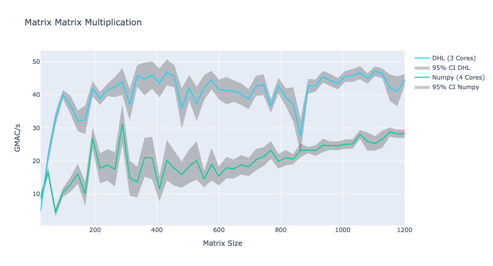
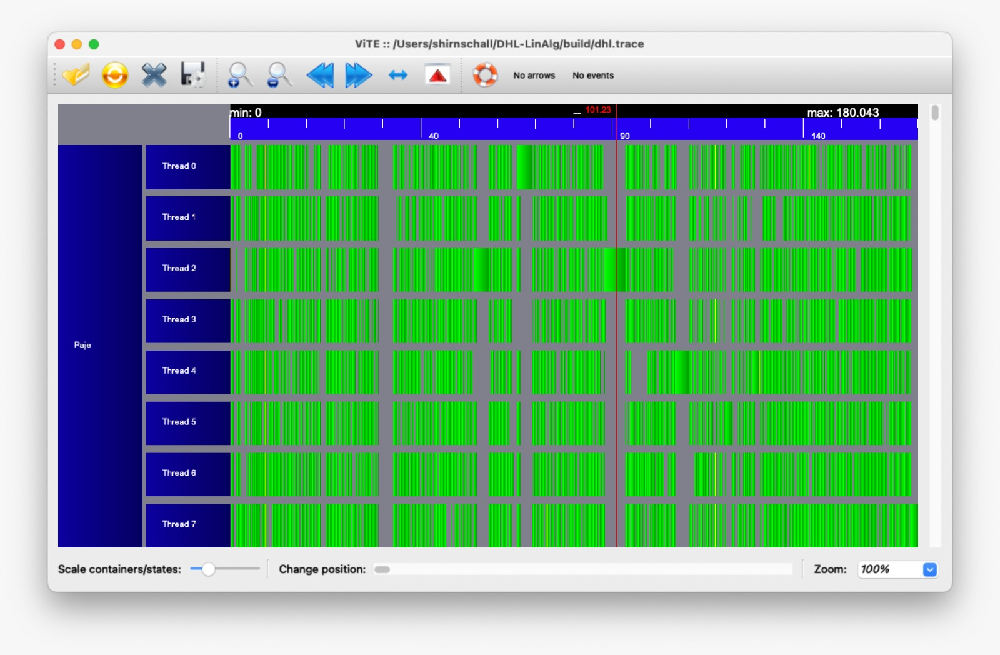

.. DHL-LinAlg documentation master file, created by
   sphinx-quickstart on Tue Aug 29 06:39:02 2023.
   You can adapt this file completely to your liking, but it should at least
   contain the root `toctree` directive.

A basic linear algebra implementation in C++ providing classes such as **Vector** and **Matrix**.
All classes are binded into python.

License
==============
DHL-LinAlg is `Free Software <http://www.gnu.org/philosophy/free-sw.html>`_ licensed under the MIT license. It, in part, is based on 
`ASC-bla <https://github.com/TUWien-ASC/ASC-bla>`_ and `ASC-HPC <https://github.com/TUWien-ASC/ASC-HPC>`_ which are also published under the MIT license.

Why use DHL-LinAlg?
===================

DHL-LinAlg is fast
~~~~~~~~~~~~~~~~~~

DHL-LinAlg is easy to use
-------------------------
..  code-block:: python

   from dhllinalg.bla import Matrix, InnerProduct

   m = Matrix(200,100)
   n = Matrix(100,200)
   for i in range(m.shape[0]):
      for j in range(m.shape[1]):
         m[i,j] = i + 2 * j
      n[:,i] = i

   w = InnerProduct(m, n)
   print(w) 

DHL-LinAlg is compatible with other libraries
-------------------------------------------------
..  code-block:: python

   from dhllinalg.bla import Matrix
   import numpy as np

   m = Matrix(223,17)
   n = Matrix(17,223)
   for i in range(m.nrows):
      for j in range(m.ncols):
         m[i,j] = i  * j
      n[:,i] = 15-i

   w = np.dot(np.asarray(m), np.asarray(n))
   print(w) 

DHL-LinAlg can write trace files
--------------------------------

DHL-LinAlg is easy to install
-----------------------------

..  code-block:: bash

   pip install dhllinalg 

----

.. toctree::
   ← Back to Github <https://github.com/DHL-ASC/DHL-LinAlg>
   
.. toctree::
   :maxdepth: 1
   :caption: Contents:

   install
   examples/index
   api_reference

.. toctree::
   :maxdepth: 1
   :caption: Information:

   changelog/index

.. title:: DHL-LinAlg